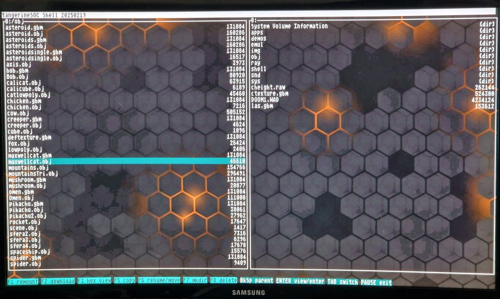
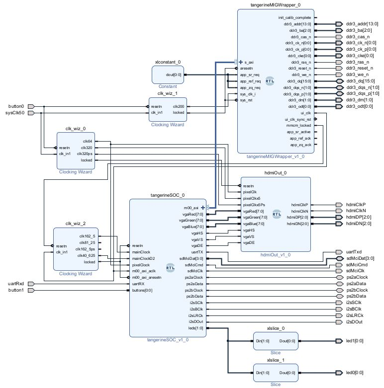
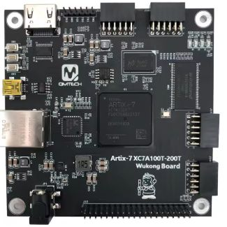

# Tangerine A7_100 

Risc-V based system for Qmtech Artix Wukong board.

## Features:
- nekoRv: Risc-V 32 IM Zicsr core running at 162.5MHz
- VGA controller with 720p output, 16-bit graphics + hardware text overlay
- axiDma controller with 128KB I/D 4-way cache connected to AMD MIG via axi4-full bus
- fast block data transfer engine within axiDma controller ( fast data copy, fill, shift )
- 2D Blitter graphics coprocessor - fast bitmap copy, scale, fade ( alpha channel )
- 3D Blitter graphics coprocessor - triangle rasterization with texturing, light, Gouraud shading, hardware Z-buffer
- I2S audio DAC controller ( PCM5102 ) with fifo
- memory mapped floating point ALU
- serial interface for program upload / data transfer
- SPI interface ( SD-Card support )
- double PS-2 host controller for keyboard and mouse ( USB keyboards can be used in legacy PS2 mode )
- bsp, libraries, games, software examples in Software directory

System designed in VHDL, project maintained in Vivado 2023.1

## System diagram

## Wukong board documentation

https://github.com/ChinaQMTECH/QM_XC7A100T_WUKONG_BOARD/tree/master/V3

